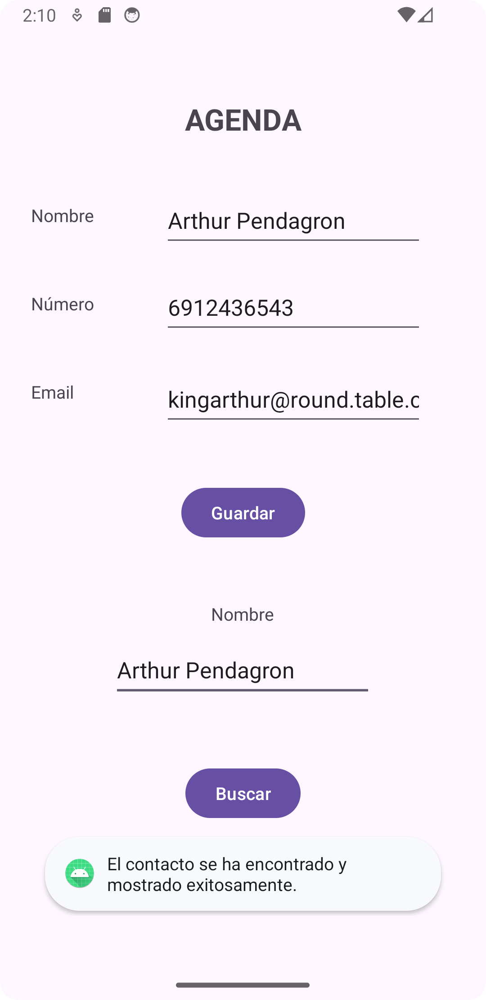

# Agenda de contactos para Android
Este proyecto es parte de una práctica universitaria que implica el desarrollo de una aplicación para dispositivos Android que permita guardar y cargar contactos mediante un formulario. 
La aplicación ofrece la funcionalidad de ingresar información básica de contacto, incluyendo nombre, teléfono y correo electrónico.

# Evidencia de la funcionalidad:

## Guadar datos:

  
## Cargar datos (correcto):

## Cargar datos (incorrecto):

